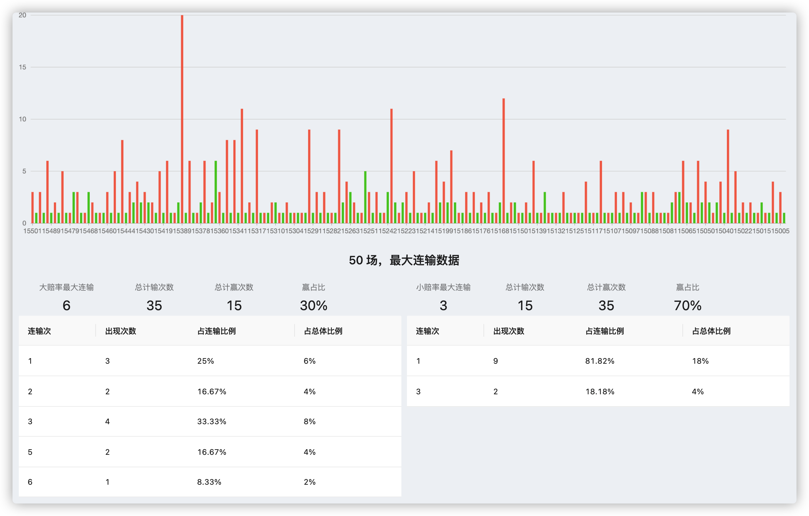
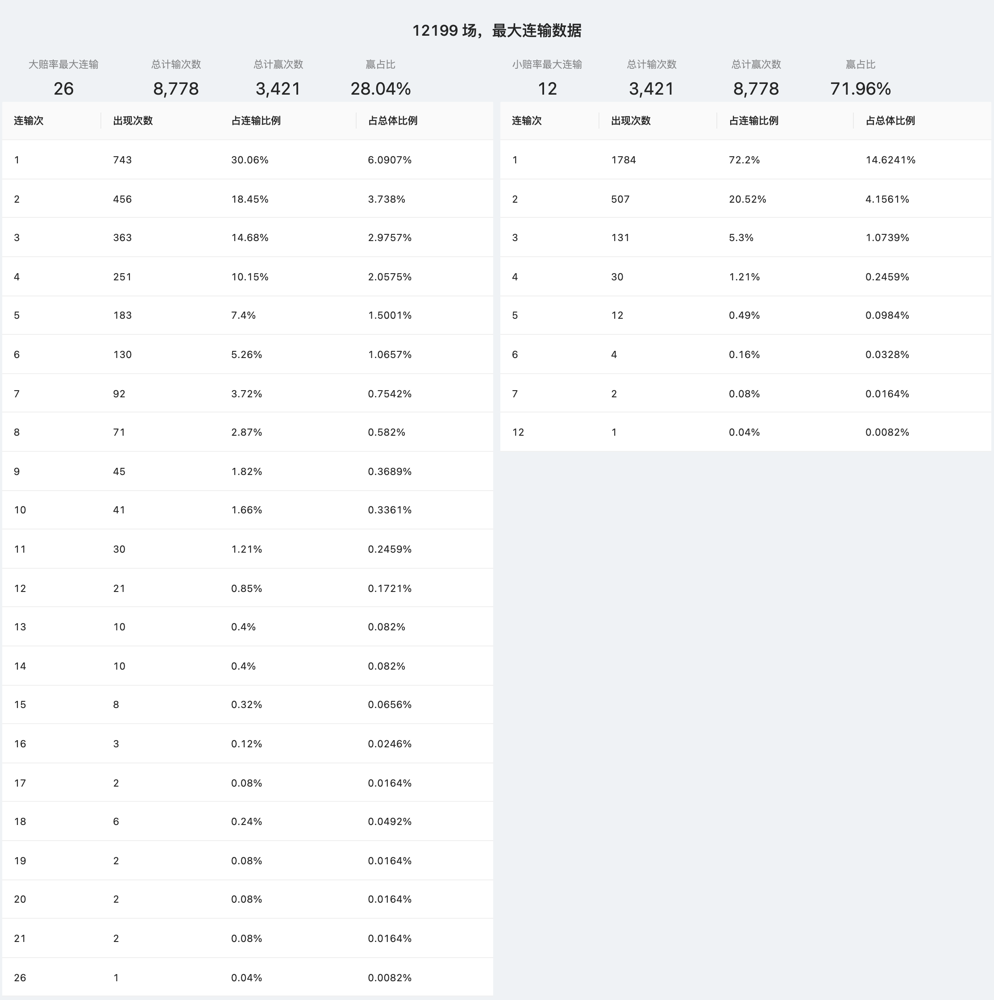

# PancakeSwap Prediction Game Bot

## 功能

自动监听链上投注行为，并按照设定的投注算法进行`高赔率`或`低赔率`进行下注。

## 投注策略

### 高赔率(>2.0x)倍投

`高赔率(>2.0x)`倍投，例如当投注第一次为 0.1，若输则第二次投注 0.2，若输则第三次投注 0.4，以此类推。

因为投注无上限限制，理论上只要最终赢一次，则可盈利，但有失败风险（最高连输曾经出现26次连输）

### 低赔率(<2.0x)跟投

`低赔率(<2.0x)`跟投，在统计阶段，利用爬虫拉取了 *>12000* 场次的对局记录进行数据分析发现，低赔率的胜率高于69.5%，并且连续输的次数较少，基于这个现象进行跟单

同时可建立倍投机制，如投注为 0.1，若输下次的投注则为 `0.1 + n / (m -1)`，其中 `m = 赔率`，`n = 上次投注金额`

## 风险

以上内容均为理论，但目前`Prediction` 进行了游戏调整，实际在对局时间仅剩几秒时，发起投注，均会被判定投注失败。

最终导致，以上策略均无法有效进行，所以对这个项目进行的开源分享，也许你可以找到它的价值。

## 如何使用

安装`node.js@14.x`与`yarn@1.x` 版本后，在项目目录进行以下操作

1. 安装资源依赖

> 执行 `yarn` 进行安装资源依赖

2. 基础配置

> 复制 `priject-config_BAK.json` 为 `priject-config.json` 并进行相关配置

注意：其中`account`与`privateKey` 为必填项;

其余的参数为选填，目前暂未完善`telegram`消息推送，所以无此功能

3. 执行启动

> 执行 `yarn dev` 进行服务启动.

## 项目结构与核心模块介绍

`wallet/wallet.ts`: 钱包模块，通过`ethers`进行钱包余额获取;

`precent-game/marketDataMonitor.ts`: 对局情况监听与各类事件回调，如对局开始、对局结束、对局投注数据变化;

`precent-game/betManager.ts`: 投注管理器组件，对于投注算法管理、或实现模拟投注等功能;

`precent-game/bet.ts`: 投注组件，使用钱包进行投注功能，提供`低倍率`与`高倍率`投注函数;

`precent-game/main.ts`: 主要自动化逻辑组件

## 投注数据监听模式

1. 链上监听，基于 `ethers` 对 `BSC链`上 prediction合约 `events` 进行监听，推荐;
2. BSCScan监听，基于 [BSCScan上 Prediction合约](https://bscscan.com/address/0x516ffd7d1e0ca40b1879935b2de87cb20fc1124b) 进行爬虫请求监听，需要爬虫代理;
3. GRT监听，基于 `The Graph` API 进行轮询请求监听，同官网投注记录中获取的方式，但利用爬虫池来加速获取频率。

## 常见问题

> 1. 为什么不使用多线程

实际投注只有在接近结束时才会产生大量数据变化，并且经过测试，现有的投注数据更新频率，单线程高频爬虫和多线程在获取上差异不大。

> 2. 风险

本项目所有观点、技术实现，仅代表个人立场以及个人操作，不具有任何指导作用，据此操作，风险自负。

同时参考 [#风险](#风险)

> 3. 如何获取历史对局数据

可查阅仓库中 `precent-game/getBetHistory.ts` 代码，通过GraphQL来获取历史数据。

同时在 `src/images/` 中提供 50场 和 12000+场 的对局连输分析截图，仅供参考。

> 4. 代码为什么`测试用例`都没有，连编译功能都没有

🙂 这只是一个实验性项目，而且我很懒。

## 赞助与联系

赞助地址：0x7c7e3d739230CB806e12b713a869aC766141901d

Telegram: [@DeeToTheMoon](https://t.me/DeeToTheMoon)